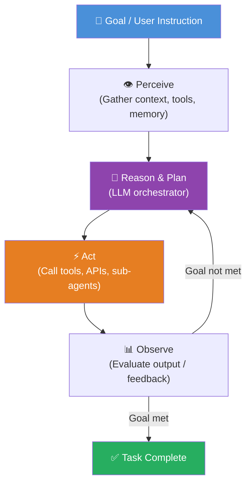
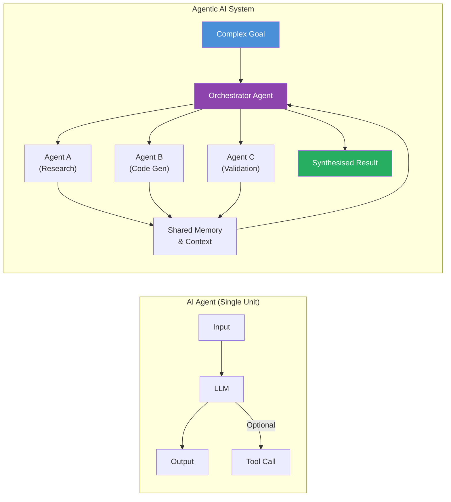
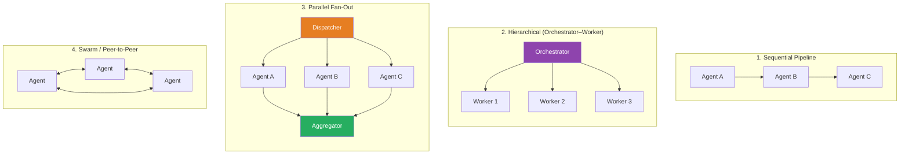
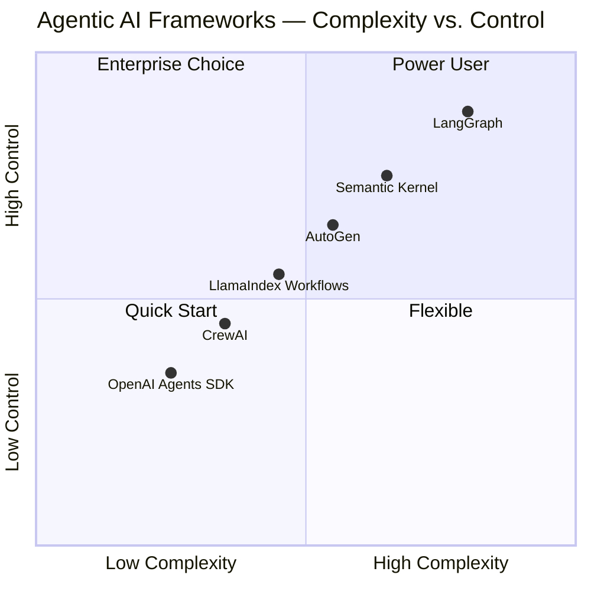
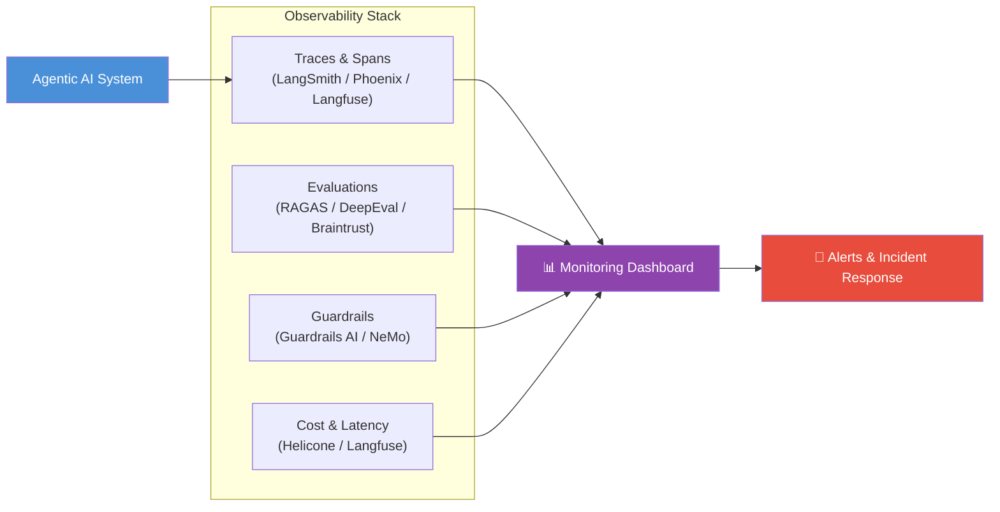

> *Having spent years designing and deploying systems — from classic ML pipelines to multi-model production workloads — the shift to Agentic AI is the most architecturally significant change that we are seeing in the market. It is not just about smarter models; it is about systems that think, plan, delegate, and act with minimal human intervention. This article is my attempt to distill the essence of Agentic AI from an architect's lens.*

---

## What is Agentic AI?

Agentic AI refers to AI systems that can autonomously pursue goals over multiple steps by perceiving their environment, reasoning about a plan, using tools, and taking actions — iterating until the objective is achieved. Unlike a traditional AI that responds to a single prompt, an Agentic AI system operates in a **sense → plan → act → observe** loop, often orchestrating multiple AI models, APIs, and data sources to complete complex, open-ended tasks.

The defining trait of Agentic AI is **agency** — the capacity to make decisions, take initiative, recover from failures, and adapt its strategy without waiting for human instruction at every step.

---

## Key Terms in Agentic AI — Explained

The Agentic AI landscape has its own vocabulary. Here is a concise reference for architects and engineers:

| Term | One-Line Explanation |
|---|---|
| **Agent** | An autonomous AI entity that perceives its environment, reasons, and takes actions toward a goal. |
| **Orchestrator** | The top-level agent or controller that breaks down goals, assigns tasks to sub-agents, and aggregates results. |
| **Sub-Agent** | A specialised agent invoked by an orchestrator to handle a specific subtask (e.g., a web search agent). |
| **Tool / Function Calling** | External capabilities (APIs, databases, code executors) the agent can invoke during its reasoning loop. |
| **ReAct Loop** | A prompting pattern (**Re**ason + **Act**) where the LLM alternates between reasoning steps and action calls. |
| **Chain-of-Thought (CoT)** | A prompting technique that encourages the model to generate intermediate reasoning steps before a final answer. |
| **Memory** | State persistence for an agent — short-term (in-context), long-term (vector store), or episodic (conversation history). |
| **RAG (Retrieval-Augmented Generation)** | A pattern where the agent retrieves relevant documents from a knowledge base before generating a response. |
| **Planner** | A component (often an LLM call) that decomposes a high-level goal into an ordered list of actionable steps. |
| **Executor** | The component that runs each step of the plan, calling tools and managing results. |
| **Reflection / Critic** | A self-evaluation step where the agent reviews its own output for correctness before proceeding. |
| **Human-in-the-Loop (HITL)** | A design pattern where a human is required to approve or correct agent actions at defined checkpoints. |
| **Guardrails** | Policy layers that constrain agent behaviour — preventing harmful, off-topic, or unsafe actions. |
| **Context Window** | The maximum amount of text (tokens) an LLM can process in a single interaction; a critical constraint in agent design. |
| **Handoff** | The mechanism by which one agent transfers control and relevant context to another agent. |
| **Multi-Agent System (MAS)** | An architecture with multiple independent agents collaborating or competing to solve a problem. |
| **Swarm** | A loosely coupled multi-agent pattern where many simple agents coordinate without a central orchestrator. |
| **Semantic Routing** | Directing an incoming query to the most suitable agent or tool based on the meaning of the request. |
| **Tool Registry** | A catalogue of available tools with descriptions that an agent uses to decide which tool to call. |
| **Checkpointing** | Saving the agent's state at intermediate steps to enable recovery from failures or resumption of long tasks. |

---

## Agentic AI vs. AI Agent — What Is the Difference?

This is one of the most common points of confusion I encounter, even among experienced engineers.

**An AI Agent** is a *component* — a single autonomous unit that perceives input and produces output, possibly using tools. It is a well-defined entity.

**Agentic AI** is an *architectural paradigm* — a system-level design philosophy where AI agents operate with high autonomy, long-horizon reasoning, dynamic tool use, and often multi-agent collaboration to achieve complex goals.

Think of it this way:

> *An AI Agent is a single footballer. Agentic AI is the entire team with a game strategy, a coach (orchestrator), and a playbook (memory + tools) — playing a 90-minute match autonomously.*

| Dimension | AI Agent | Agentic AI |
|---|---|---|
| Scope | Single task, single unit | Multi-step, multi-agent, system-level |
| Autonomy | Limited, often single-turn | High, self-directed over long horizons |
| Planning | Minimal | Central capability (planners, CoT, ReAct) |
| Memory | Usually stateless | Short-term, long-term, episodic |
| Collaboration | Standalone | Multi-agent orchestration |
| Failure handling | Fails or returns error | Self-corrects, retries, delegates |
| Human involvement | Often per-turn | Configurable HITL at critical checkpoints |

---

## Agentic AI Architecture Patterns

As an architect, choosing the right topology is as important as choosing the right model. Here are the four patterns I use most frequently:

- **Sequential Pipeline** — Each agent processes and passes output to the next. Great for structured workflows (extract → transform → validate).
- **Hierarchical** — An orchestrator delegates to specialised workers. Ideal for complex research or software engineering tasks.
- **Parallel Fan-Out** — Multiple agents work simultaneously on sub-problems, then results are aggregated. Best for latency-sensitive tasks.
- **Swarm** — Agents communicate peer-to-peer without a central controller. Suited for exploration, brainstorming, and adversarial evaluation.

---

## Popular Frameworks for Building Agentic AI

I have worked extensively with most of these frameworks in production. Here is my honest assessment:

### 1. LangGraph (LangChain)
A graph-based orchestration framework where agent workflows are defined as stateful graphs (nodes = agents/tools, edges = transitions). Best suited for complex, branching workflows with explicit state management.
- **Strengths:** Fine-grained control, built-in checkpointing, excellent for cyclical graphs (ReAct loops).
- **Watch out:** Steeper learning curve; verbose graph definitions for simple flows.

### 2. Microsoft AutoGen
A multi-agent conversation framework where agents communicate via structured messages. Supports human-in-the-loop natively.
- **Strengths:** Excellent for conversational multi-agent patterns, strong .NET and Python support.
- **Watch out:** Conversation-centric model can be limiting for non-dialogue workflows.

### 3. CrewAI
A role-based multi-agent framework inspired by human team structures. Agents have defined roles, goals, and backstories.
- **Strengths:** Intuitive role/task abstraction, rapid prototyping, built-in process types (sequential, hierarchical).
- **Watch out:** Less control over low-level agent behaviour compared to LangGraph.

### 4. OpenAI Agents SDK (formerly Swarm)
OpenAI's first-party lightweight SDK for building and orchestrating multi-agent systems with handoffs and tool use.
- **Strengths:** Simplest mental model, tight integration with OpenAI models, first-class handoff support.
- **Watch out:** OpenAI ecosystem lock-in; less suitable for complex stateful workflows.

### 5. Semantic Kernel (Microsoft)
An enterprise-grade SDK that treats AI capabilities as "plugins" with structured metadata. Deeply integrated with Azure AI.
- **Strengths:** Enterprise patterns, strong Azure/M365 integration, supports C#, Python, Java.
- **Watch out:** Heavier abstractions; plugin model can add indirection.

### 6. LlamaIndex (Workflows)
Primarily known for RAG, LlamaIndex Workflows allows defining agent pipelines as event-driven workflows.
- **Strengths:** Best-in-class data connectors and retrieval; natural fit when RAG is central.
- **Watch out:** Workflow API is newer and evolving rapidly.

---

## Popular Tools to Monitor Agentic AI

Observability is where most teams underinvest — and pay the price in production. Agentic systems are non-deterministic, long-running, and multi-hop. Standard APM tools are insufficient. Here is the monitoring stack I recommend:

### Tracing & Observability

| Tool | Description |
|---|---|
| **LangSmith** | LangChain's native tracing platform. Captures every LLM call, tool invocation, and token count in an agent run. Ideal if you are on the LangChain/LangGraph stack. |
| **Arize Phoenix** | Open-source LLM observability with traces, spans, and evaluation. Framework-agnostic via OpenTelemetry. |
| **Langfuse** | Open-source LLM engineering platform with traces, evals, prompt management, and cost tracking. Self-hostable. |
| **Weights & Biases (W&B) Weave** | Tracing and evaluation layer built on W&B. Strong for teams already using W&B for ML experiment tracking. |
| **Microsoft Azure AI Foundry** | End-to-end observability for agents deployed on Azure — traces, evaluations, safety filters, and cost dashboards. |
| **Helicone** | Proxy-based observability for LLM APIs. Zero-code integration; captures latency, cost, and errors per request. |

### Evaluation & Quality

| Tool | Description |
|---|---|
| **RAGAS** | Framework for evaluating RAG pipelines — faithfulness, answer relevance, context recall. |
| **DeepEval** | Pytest-like evaluation framework for LLM outputs with 14+ built-in metrics. |
| **Braintrust** | Evaluation and prompt management platform with dataset management and regression tracking. |
| **Promptfoo** | CLI/CI-friendly LLM evaluation and red-teaming tool. Integrates easily into DevOps pipelines. |

### Guardrails & Safety

| Tool | Description |
|---|---|
| **Guardrails AI** | Define input/output validation schemas for LLM responses with automatic retry on failure. |
| **NeMo Guardrails (NVIDIA)** | Programmable guardrails to control conversational AI flow, topic, and safety. |
| **Azure AI Content Safety** | Cloud API for detecting harmful content (hate, violence, self-harm) in agent inputs/outputs. |

---

## Architect's Checklist for Agentic AI Systems

After designing and reviewing dozens of Agentic AI systems, these are the non-negotiables I bring to every design review:

- [ ] **Goal decomposition is explicit** — The orchestrator's planning step is logged and inspectable.
- [ ] **Tool contracts are versioned** — Tool schemas are treated like APIs with backward-compatibility guarantees.
- [ ] **Memory has an eviction policy** — Context windows are finite; decide what to retain and what to summarise.
- [ ] **Every agent has a circuit breaker** — Prevent infinite loops with max-iteration limits and timeout policies.
- [ ] **HITL checkpoints are defined** — Know upfront which decisions require human approval (irreversible actions, high-cost calls).
- [ ] **Traces cover the full agent run** — A single user request should produce a traceable, inspectable span tree.
- [ ] **Evaluation is automated in CI** — Run a representative eval suite on every agent change before deployment.
- [ ] **Guardrails are applied at ingress and egress** — Validate both user inputs and agent outputs.
- [ ] **Cost is metered per task** — Track token usage, tool call counts, and latency per agent run in production.
- [ ] **Failure modes are documented** — Capture what happens when tools are unavailable, models hallucinate, or context is exhausted.

---

## Closing Thoughts

Agentic AI is not a trend — it is the convergence of LLMs, tooling, orchestration, and observability into a new class of software systems. The architects who will succeed in this space are those who treat agents not as black-box magic, but as distributed systems with all the rigor that entails: clear interfaces, explicit state management, failure-tolerant design, and production observability.

The models will keep improving. The architecture patterns you establish today will determine whether your Agentic AI systems scale gracefully or collapse under real-world conditions.

Build thoughtfully. Monitor obsessively. Iterate continuously.

---

*Written from the perspective of an Agentic AI Architect with hands-on experience designing multi-agent systems across cloud, enterprise, and research domains. The frameworks and tools referenced reflect the ecosystem as of May 2026.*
