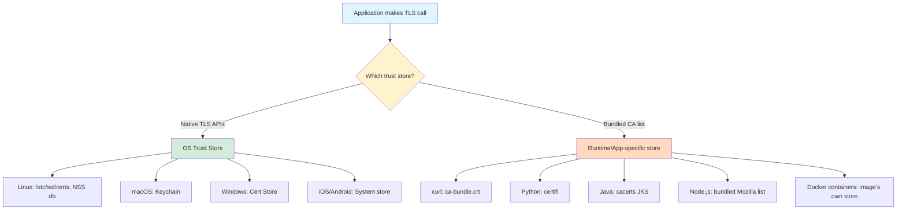
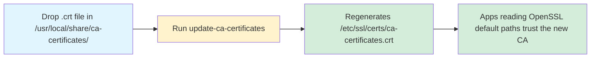
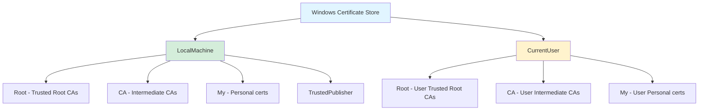
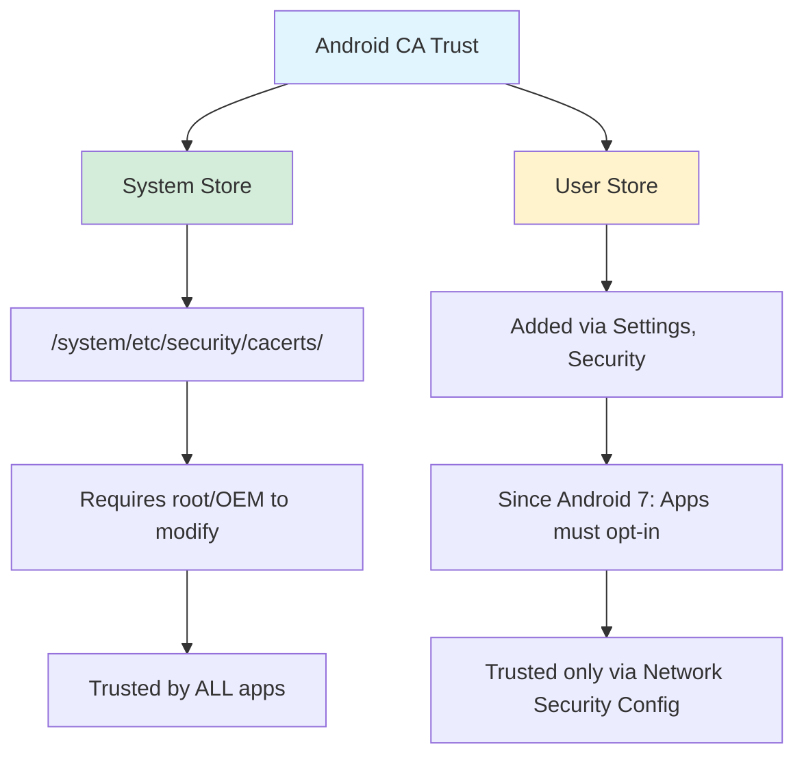

# Certificate & Key Stores by Operating System

Every operating system ships with a **trust store** — a curated set of Certificate Authority (CA) certificates the OS considers trustworthy. When your browser, `curl`, or any TLS-aware application makes an HTTPS call, it typically consults this store to decide whether the peer certificate is valid.

In enterprise environments, you often need to add a **corporate/custom CA** (for example, a Zscaler/Netskope TLS-interception proxy, an Active Directory Certificate Services root, or a home-lab CA) so applications don't reject those intercepted or internally-signed connections.

This post walks through the default trust stores on major operating systems and shows exactly how to import a custom CA into each. If you're new to certificates, start with [Understanding Certificates: A Comprehensive Guide](/posts/basics/certificates/understanding-certificates).

<!-- more -->

## Big Picture: OS Trust vs Application Trust

Not every application uses the OS trust store. Many runtimes ship their own bundled CA list. Understanding this fork is critical when a cert works in the browser but fails in `python`, `curl`, or a Java app.



> Applications like Firefox, Java, Python (`requests`), Node.js, and Go often bypass the OS store entirely. Adding a CA to the OS is often **necessary but not sufficient**. See the companion post on language/tool stores.
{: .prompt-warning }

## Trust Store Location Cheat Sheet

| OS | Primary Store | System-wide CA Trust Path | User-scope Path |
|----|---------------|---------------------------|-----------------|
| **Debian/Ubuntu** | `ca-certificates` | `/etc/ssl/certs/ca-certificates.crt` | varies by app |
| **RHEL/CentOS/Fedora** | `ca-certificates` (p11-kit) | `/etc/pki/ca-trust/extracted/pem/tls-ca-bundle.pem` | N/A |
| **Alpine** | `ca-certificates` | `/etc/ssl/certs/ca-certificates.crt` | N/A |
| **macOS** | Keychain | `/Library/Keychains/System.keychain` | `~/Library/Keychains/login.keychain-db` |
| **Windows** | Certificate Store | `Cert:\LocalMachine\Root` | `Cert:\CurrentUser\Root` |
| **iOS** | System store | Configuration Profiles / MDM | ATS per-app |
| **Android** | System + user store | `/system/etc/security/cacerts/` | `/data/misc/user/0/cacerts-added/` |
| **Firefox / Thunderbird** | NSS database | `~/.mozilla/firefox/<profile>/cert9.db` | Per-profile |
| **Chrome (Linux)** | NSS shared DB | `~/.pki/nssdb` | Per-user |

## Linux: Debian / Ubuntu

Debian-based distros use the `ca-certificates` package, which maintains a merged bundle from certs dropped into `/usr/local/share/ca-certificates/` (custom) and `/usr/share/ca-certificates/` (system-provided).



### Import Corporate CA

```bash
# 1. Copy your CA cert (must be PEM, .crt extension required)
sudo cp corporate-root-ca.crt /usr/local/share/ca-certificates/

# 2. Rebuild the merged bundle and system symlinks
sudo update-ca-certificates

# 3. Verify
awk -v cmd='openssl x509 -noout -subject' '/BEGIN/{close(cmd)};{print | cmd}' \
  /etc/ssl/certs/ca-certificates.crt | grep -i corporate
```

> Files in `/usr/local/share/ca-certificates/` **must** end in `.crt` and be PEM-encoded, or `update-ca-certificates` silently skips them.
{: .prompt-tip }

### Verify

```bash
openssl s_client -connect internal.corp.example.com:443 -CApath /etc/ssl/certs </dev/null
```

## Linux: RHEL / CentOS / Fedora / Rocky

RHEL-family uses **p11-kit**. Certs go into `/etc/pki/ca-trust/source/anchors/`.

```bash
sudo cp corporate-root-ca.crt /etc/pki/ca-trust/source/anchors/
sudo update-ca-trust extract
trust list --filter=ca-anchors | grep -i corporate
```

Extracted bundles land at:
- `/etc/pki/ca-trust/extracted/pem/tls-ca-bundle.pem`
- `/etc/pki/ca-trust/extracted/java/cacerts`
- `/etc/pki/ca-trust/extracted/openssl/ca-bundle.trust.crt`

> `p11-kit` writes a Java-format store, but most JDKs point at their own bundled `cacerts` — see the companion post.
{: .prompt-info }

## Linux: Alpine

Alpine is common inside Docker images. Alpine's `update-ca-certificates` does **not** update the JVM cacerts — a common gotcha for Java containers behind TLS-inspecting proxies.

```dockerfile
FROM alpine:3.20
RUN apk add --no-cache ca-certificates
COPY corporate-root-ca.crt /usr/local/share/ca-certificates/
RUN update-ca-certificates
```

## macOS: Keychain

Two scopes:
- **System keychain**: all users on the machine
- **Login keychain**: current user only

### GUI

1. Open **Keychain Access** → select **System**
2. Drag the `.crt` / `.pem` / `.cer` file in
3. Double-click the cert → **Trust** → *"When using this certificate"* = **Always Trust**
4. Authenticate as admin

### CLI

```bash
# System-wide
sudo security add-trusted-cert -d -r trustRoot \
  -k /Library/Keychains/System.keychain \
  corporate-root-ca.pem

# User-only
security add-trusted-cert -d -r trustRoot \
  -k ~/Library/Keychains/login.keychain-db \
  corporate-root-ca.pem

# Verify
security find-certificate -c "Corporate Root CA" -p /Library/Keychains/System.keychain
```

> Keychain is the store for Safari, `curl`, and native macOS apps — but **not** Firefox (NSS), Java (JKS), or Python (certifi).
{: .prompt-warning }

## Windows: Certificate Store



### `certutil`

```powershell
# LocalMachine (elevated shell)
certutil -addstore -f "Root" corporate-root-ca.crt

# CurrentUser
certutil -user -addstore -f "Root" corporate-root-ca.crt

# Intermediate CA
certutil -addstore -f "CA" corporate-intermediate-ca.crt
```

### PowerShell

```powershell
Import-Certificate -FilePath .\corporate-root-ca.crt `
  -CertStoreLocation Cert:\LocalMachine\Root

Get-ChildItem Cert:\LocalMachine\Root | Where-Object Subject -Match "Corporate"
```

### MMC (GUI)

1. `Win+R` → `mmc.exe`
2. **File** → **Add/Remove Snap-in** → **Certificates**
3. Choose **Computer account** or **My user account**
4. **Trusted Root Certification Authorities** → **Certificates** → right-click → **All Tasks** → **Import**

### Group Policy

For domain-joined machines: GPMC → **Computer Configuration** → **Policies** → **Windows Settings** → **Security Settings** → **Public Key Policies** → **Trusted Root Certification Authorities** → **Import**.

## iOS: Configuration Profiles

iOS does **not** allow drag-and-drop like macOS. You must deliver a **Configuration Profile** and then enable full trust.

1. Package the CA in a `.mobileconfig` (Apple Configurator 2 or MDM)
2. Deliver via email/web/AirDrop/MDM
3. **Settings** → **General** → **VPN & Device Management** → **Install**
4. **Critical**: **Settings** → **General** → **About** → **Certificate Trust Settings** → toggle full trust ON

> Skipping step 4 leaves the cert installed but **not trusted** for TLS.
{: .prompt-danger }

## Android: System vs User Store



### User-installed CA (Android 7+)

1. Copy CA to device storage
2. **Settings** → **Security** → **Encryption & credentials** → **Install a certificate** → **CA certificate**
3. Add `res/xml/network_security_config.xml` in your app:

```xml
<network-security-config>
    <base-config>
        <trust-anchors>
            <certificates src="system" />
            <certificates src="user" />
        </trust-anchors>
    </base-config>
</network-security-config>
```

And reference it in `AndroidManifest.xml`:

```xml
<application android:networkSecurityConfig="@xml/network_security_config">
```

> Without opting in via Network Security Config, user-added CAs are ignored by third-party apps on Android 7+.
{: .prompt-warning }

## Browsers: NSS Database

Firefox, Thunderbird, and Chrome on Linux use Mozilla's **NSS**, storing certs in `cert9.db`.

### Firefox

```bash
certutil -A -n "Corporate Root CA" -t "CT,C,C" \
  -i corporate-root-ca.crt \
  -d sql:$HOME/.mozilla/firefox/<profile-id>
```

Or GUI: **Settings** → **Privacy & Security** → **Certificates** → **View Certificates** → **Authorities** → **Import**.

### Chrome on Linux

```bash
certutil -d sql:$HOME/.pki/nssdb -A -t "C,," -n "Corporate Root CA" \
  -i corporate-root-ca.crt
certutil -d sql:$HOME/.pki/nssdb -L
```

> Chrome on **macOS/Windows** uses the OS store. Chrome on **Linux** is the odd one out.
{: .prompt-info }

## Docker & Containers

### Pattern 1: Bake CA into image

```dockerfile
FROM ubuntu:24.04
COPY corporate-root-ca.crt /usr/local/share/ca-certificates/
RUN apt-get update && apt-get install -y ca-certificates \
    && update-ca-certificates
```

### Pattern 2: Mount at runtime

```bash
docker run \
  -v /etc/ssl/certs/ca-certificates.crt:/etc/ssl/certs/ca-certificates.crt:ro \
  myapp:latest
```

> Container builds behind Zscaler/Netskope often fail at `apt`/`pip`/`npm` steps because the container's trust store lacks the interception CA. Pattern 1 is the durable fix.
{: .prompt-tip }

## WSL

WSL is a real Linux kernel — it does **not** inherit Windows's trust store. Import via the Debian/RHEL steps above. If you use `wsl-vpnkit` behind a corporate proxy, import the CA into both Windows and WSL.

## End-to-End Verification

```bash
# Simple check
openssl s_client -connect internal.corp.example.com:443 -showcerts </dev/null 2>&1 \
  | grep -E "verify|subject|issuer"

# Explicit CA path
openssl verify -CAfile /etc/ssl/certs/ca-certificates.crt server-cert.pem

# curl uses OS store on Linux/macOS
curl -v https://internal.corp.example.com/ 2>&1 | grep -E "SSL|CA"
```

Look for `Verification: OK` / `verify return:1`. If you see `unable to get local issuer certificate`, see [Certificates - Unable to get local issue certificate](/posts/basics/certificates/Unable-to-get-local-issuer-certificate-error).

## Common Pitfalls

| Symptom | Likely Cause | Fix |
|---------|--------------|-----|
| `curl` works, `python` fails | Python uses `certifi`, not OS store | Import into `certifi` or set `REQUESTS_CA_BUNDLE` |
| Browser trusts cert, Firefox doesn't | Firefox uses NSS | Import into Firefox profile |
| Android app rejects imported cert | Network Security Config missing | Declare user CAs as trust anchor |
| iOS: cert installed, TLS fails | Full Trust not enabled | Enable in Certificate Trust Settings |
| Docker build fails at `pip install` | Container's trust store lacks CA | Bake CA into image |
| Java app fails, OS is fine | JVM uses its own `cacerts` | `keytool -import` into JDK cacerts |
| Alpine container Java app fails | Alpine doesn't sync OS trust into JVM | `keytool -import` manually |

The last three rows point at **application/runtime-specific trust stores** — the subject of the companion post.

## Related Posts

- [Understanding Certificates: A Comprehensive Guide](/posts/basics/certificates/understanding-certificates)
- [Certificate Stores for Programming Languages & Common Tools](/posts/basics/certificates/keystores-programming-languages-and-tools)
- [Certificates - Unable to get local issue certificate](/posts/basics/certificates/Unable-to-get-local-issuer-certificate-error)
