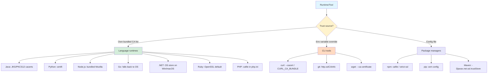

# Certificate Stores for Programming Languages & Common Tools

The [previous post](/posts/basics/certificates/certificate-stores-by-operating-system) covered OS-level trust stores. This one covers what most people actually get bitten by: **language runtimes and tools that maintain their own private trust stores**, ignoring the OS entirely.

If you've ever imported a corporate CA at the OS level and thought "great, done" — only to have `pip install`, `mvn package`, `npm install`, or `curl` from a Java app still fail — this post is for you.

<!-- more -->

## The Landscape



## Quick Reference: Where Each Runtime Looks

| Runtime | Default trust source | Override env var / config |
|---------|---------------------|---------------------------|
| **Java (JDK)** | `$JAVA_HOME/lib/security/cacerts` (JKS/PKCS12) | `-Djavax.net.ssl.trustStore=...` |
| **Python** | `certifi` module bundle | `REQUESTS_CA_BUNDLE`, `SSL_CERT_FILE`, `CURL_CA_BUNDLE` |
| **Node.js** | Bundled Mozilla list | `NODE_EXTRA_CA_CERTS=/path/to/ca.pem` |
| **Go** | OS trust store (Linux/macOS/Windows) | `SSL_CERT_FILE`, `SSL_CERT_DIR` |
| **.NET (Windows/macOS)** | OS store | N/A (use OS store) |
| **.NET (Linux)** | OpenSSL / OS bundle | `SSL_CERT_FILE`, `SSL_CERT_DIR` |
| **Ruby** | OpenSSL default path | `SSL_CERT_FILE` |
| **PHP** | `openssl.cafile` in `php.ini` | `curl.cainfo`, `openssl.cafile` |
| **curl** | System `ca-bundle` | `CURL_CA_BUNDLE`, `--cacert` |
| **git** | Uses OpenSSL/schannel/OS | `http.sslCAInfo`, `GIT_SSL_CAINFO` |
| **AWS CLI** | Python `certifi` | `AWS_CA_BUNDLE`, `--ca-bundle` |
| **kubectl** | OS trust store | `--certificate-authority` |
| **Terraform** | OS trust store | Provider-specific |
| **Docker (daemon)** | `/etc/docker/certs.d/<registry>/ca.crt` | Per-registry |

## Java: cacerts (JKS / PKCS12)

Java maintains a keystore separate from the OS. It's typically at `$JAVA_HOME/lib/security/cacerts`.

- **Default password**: `changeit`
- **Format**: JKS (older) or PKCS12 (JDK 9+ default)

### Import a Corporate CA

```bash
# Import
sudo keytool -importcert \
  -trustcacerts \
  -alias corporate-root-ca \
  -file corporate-root-ca.crt \
  -keystore "$JAVA_HOME/lib/security/cacerts" \
  -storepass changeit \
  -noprompt

# List
keytool -list -keystore "$JAVA_HOME/lib/security/cacerts" \
  -storepass changeit | grep -i corporate

# Delete (if needed)
sudo keytool -delete -alias corporate-root-ca \
  -keystore "$JAVA_HOME/lib/security/cacerts" \
  -storepass changeit
```

### Per-Application Truststore

Prefer a **per-app truststore** over modifying the JDK-wide cacerts (it survives JDK upgrades):

```bash
# Build app-specific truststore
keytool -importcert -trustcacerts \
  -alias corporate-root-ca \
  -file corporate-root-ca.crt \
  -keystore app-truststore.jks \
  -storepass mysecret -noprompt

# Run with it
java -Djavax.net.ssl.trustStore=app-truststore.jks \
     -Djavax.net.ssl.trustStorePassword=mysecret \
     -jar myapp.jar
```

### Maven / Gradle

```bash
# Maven
mvn -Djavax.net.ssl.trustStore=/path/to/truststore.jks \
    -Djavax.net.ssl.trustStorePassword=changeit clean install

# Gradle (in gradle.properties)
systemProp.javax.net.ssl.trustStore=/path/to/truststore.jks
systemProp.javax.net.ssl.trustStorePassword=changeit
```

> **Alpine JDK images**: `update-ca-certificates` does NOT sync the OS store into the JVM cacerts. You must `keytool -importcert` explicitly.
{: .prompt-warning }

## Python: certifi

Python's `requests`, `urllib3`, `httpx`, and most HTTP libraries use the [`certifi`](https://pypi.org/project/certifi/) package — a bundled copy of Mozilla's CA list.

### Locate the bundle

```bash
python -c "import certifi; print(certifi.where())"
# Typical: /path/to/site-packages/certifi/cacert.pem
```

### Option 1: Env variables (recommended)

```bash
export REQUESTS_CA_BUNDLE=/etc/ssl/certs/ca-certificates.crt
export SSL_CERT_FILE=/etc/ssl/certs/ca-certificates.crt
export CURL_CA_BUNDLE=/etc/ssl/certs/ca-certificates.crt
```

These honor the OS trust store on Debian/Ubuntu — the cleanest solution when your OS store already has the CA.

### Option 2: Append to certifi's bundle

```bash
cat corporate-root-ca.crt >> "$(python -c 'import certifi; print(certifi.where())')"
```

> This works but is **wiped on `pip install --upgrade certifi`**. Prefer env-var overrides or a wrapped `certifi` package (e.g. `pip-system-certs`).
{: .prompt-warning }

### Option 3: `pip-system-certs`

```bash
pip install pip-system-certs
```

Monkey-patches `pip`, `requests`, `urllib3` to use the OS trust store instead of `certifi`.

### `pip` and `pip.conf`

```ini
# ~/.config/pip/pip.conf (Linux/macOS) or %APPDATA%\pip\pip.ini (Windows)
[global]
cert = /etc/ssl/certs/ca-certificates.crt
```

## Node.js

Node bundles its own copy of the Mozilla CA list, compiled into the binary.

### Add extra CAs

```bash
export NODE_EXTRA_CA_CERTS=/etc/ssl/certs/ca-certificates.crt
# Or a single custom CA:
export NODE_EXTRA_CA_CERTS=/path/to/corporate-root-ca.crt
```

Works for Node itself, `npm`, `yarn`, `pnpm`, and virtually every Node app.

### `npm` per-project

```bash
# .npmrc
cafile=/etc/ssl/certs/ca-certificates.crt
strict-ssl=true
```

Or:

```bash
npm config set cafile /etc/ssl/certs/ca-certificates.crt
```

> `NODE_EXTRA_CA_CERTS` is the single most useful trick for Node behind a TLS-inspecting proxy. Set it once at the shell level.
{: .prompt-tip }

## Go

Go uses the **OS trust store** by default on Linux/macOS/Windows — one of the few runtimes that Just Works.

Override paths:

```bash
export SSL_CERT_FILE=/etc/ssl/certs/ca-certificates.crt
export SSL_CERT_DIR=/etc/ssl/certs
```

For custom trust in code:

```go
caCert, _ := os.ReadFile("corporate-root-ca.crt")
caPool := x509.NewCertPool()
caPool.AppendCertsFromPEM(caCert)

client := &http.Client{
    Transport: &http.Transport{
        TLSClientConfig: &tls.Config{RootCAs: caPool},
    },
}
```

## .NET

### .NET on Windows/macOS

Uses the **OS trust store** (Windows Cert Store or macOS Keychain). Import via OS-level tools — no extra steps.

### .NET on Linux

Uses OpenSSL's default paths. Import at the OS level (e.g. `update-ca-certificates`) and .NET picks it up. You can override:

```bash
export SSL_CERT_FILE=/etc/ssl/certs/ca-certificates.crt
export SSL_CERT_DIR=/etc/ssl/certs
```

### Per-`HttpClient` in code

```csharp
var handler = new HttpClientHandler
{
    ServerCertificateCustomValidationCallback = (msg, cert, chain, errors) =>
    {
        var caCert = new X509Certificate2("corporate-root-ca.crt");
        chain.ChainPolicy.ExtraStore.Add(caCert);
        chain.ChainPolicy.RevocationMode = X509RevocationMode.NoCheck;
        return chain.Build(cert);
    }
};
var client = new HttpClient(handler);
```

## Ruby

Ruby uses OpenSSL's default CA path.

```bash
# Find it
ruby -e "require 'openssl'; puts OpenSSL::X509::DEFAULT_CERT_FILE"
ruby -e "require 'openssl'; puts OpenSSL::X509::DEFAULT_CERT_DIR"

# Override
export SSL_CERT_FILE=/etc/ssl/certs/ca-certificates.crt
```

For `bundler` / `gem`:

```bash
gem sources --add https://internal-gem-repo.corp.example.com/ \
  --ca-cert /etc/ssl/certs/ca-certificates.crt
```

## PHP

Configure in `php.ini`:

```ini
openssl.cafile = /etc/ssl/certs/ca-certificates.crt
curl.cainfo = /etc/ssl/certs/ca-certificates.crt
```

Find your active `php.ini`:

```bash
php --ini
```

## Common Tools

### curl

```bash
# Per-invocation
curl --cacert /path/to/corporate-root-ca.crt https://internal.corp.example.com/

# Env variable
export CURL_CA_BUNDLE=/etc/ssl/certs/ca-certificates.crt

# .curlrc
echo "cacert = /etc/ssl/certs/ca-certificates.crt" >> ~/.curlrc
```

### Git

```bash
# Global
git config --global http.sslCAInfo /etc/ssl/certs/ca-certificates.crt

# Per-repo
git config http.sslCAInfo /etc/ssl/certs/ca-certificates.crt

# Env variable
export GIT_SSL_CAINFO=/etc/ssl/certs/ca-certificates.crt

# Windows: git-for-windows uses its own OpenSSL bundle at
# C:\Program Files\Git\mingw64\ssl\certs\ca-bundle.crt
# Append corporate CA there, OR switch to schannel:
git config --global http.sslBackend schannel
```

> On Windows, `git config --global http.sslBackend schannel` makes Git use the Windows Certificate Store — a cleaner corporate-network fix than editing bundled OpenSSL certs.
{: .prompt-tip }

### AWS CLI

```bash
# Env variable
export AWS_CA_BUNDLE=/etc/ssl/certs/ca-certificates.crt

# Per-command
aws --ca-bundle /etc/ssl/certs/ca-certificates.crt s3 ls

# ~/.aws/config
[default]
ca_bundle = /etc/ssl/certs/ca-certificates.crt
```

### kubectl

Uses the OS store by default. For a specific cluster with a custom CA:

```yaml
# ~/.kube/config
clusters:
- name: my-cluster
  cluster:
    certificate-authority: /path/to/cluster-ca.crt
    server: https://k8s.corp.example.com
```

Or embed:

```yaml
certificate-authority-data: <base64-encoded PEM>
```

### Docker Daemon (Registry TLS)

For a private registry with a custom CA:

```bash
# Registry-specific trust
sudo mkdir -p /etc/docker/certs.d/registry.corp.example.com/
sudo cp corporate-root-ca.crt /etc/docker/certs.d/registry.corp.example.com/ca.crt

# No daemon restart needed
docker pull registry.corp.example.com/myimage:latest
```

### Terraform

Terraform itself uses Go's OS trust store. Provider-specific overrides:

```hcl
# For an internal Terraform registry / private module source
provider "http" {
  # Rely on OS trust
}
```

For self-signed backend/state stores, use provider-specific `ca_cert_file` arguments or set `SSL_CERT_FILE` before running `terraform`.

### wget

```bash
# Per-invocation
wget --ca-certificate=/etc/ssl/certs/ca-certificates.crt https://internal.corp.example.com/

# ~/.wgetrc
ca_certificate = /etc/ssl/certs/ca-certificates.crt
```

## Diagnostic Recipes

### 1. Find which trust store your app is actually using

```bash
# Python
python -c "import ssl; print(ssl.get_default_verify_paths())"

# Node.js
node -e "console.log(require('tls').rootCertificates.length + ' bundled CAs')"

# Java
keytool -list -keystore "$JAVA_HOME/lib/security/cacerts" -storepass changeit | wc -l

# Go
go run <<'EOF'
package main
import ("fmt"; "crypto/x509")
func main() { p, _ := x509.SystemCertPool(); fmt.Println("Subjects:", len(p.Subjects())) }
EOF
```

### 2. Test if a specific CA is trusted

```bash
# By any OpenSSL-based tool
echo | openssl s_client -connect internal.corp.example.com:443 \
  -CAfile /etc/ssl/certs/ca-certificates.crt 2>&1 | grep "Verify return code"
# Expect: "Verify return code: 0 (ok)"
```

### 3. Force-bypass to isolate the issue (never in production)

```bash
curl -k https://...
export NODE_TLS_REJECT_UNAUTHORIZED=0   # Node
export PYTHONHTTPSVERIFY=0              # Python
git -c http.sslVerify=false clone ...
```

> These flags disable TLS verification entirely — useful only to prove "yes, the issue is trust store configuration" before applying the proper fix. **Never leave them on in production or CI.**
{: .prompt-danger }

## Decision Tree: Where to Import a CA?

```mermaid
flowchart TD
    A[Which apps need to trust the CA?] --> B{All apps on this machine?}

    B -->|Yes| C[Import into OS trust store]
    B -->|No: specific runtime| D{Which runtime?}

    D -->|Java| E[keytool into cacerts or per-app truststore]
    D -->|Python| F[Set REQUESTS_CA_BUNDLE / SSL_CERT_FILE]
    D -->|Node| G[Set NODE_EXTRA_CA_CERTS]
    D -->|.NET/Go| H[Import into OS store]
    D -->|Docker registry| I[/etc/docker/certs.d/reg/ca.crt]

    C --> J[Also do runtime-specific import if runtime ignores OS]

    style A fill:#e1f5ff
    style B fill:#fff3cd
    style D fill:#fff3cd
    style C fill:#d4edda
    style J fill:#f8d7da
```

## Anti-Patterns

1. **Disabling TLS verification** (`-k`, `NODE_TLS_REJECT_UNAUTHORIZED=0`, `PYTHONHTTPSVERIFY=0`) as a "permanent fix" — this reintroduces the man-in-the-middle risk the CA was supposed to prevent.
2. **Appending CA to `certifi/cacert.pem` in a shared image** — wiped on next `pip install --upgrade certifi`.
3. **Hard-coding CA paths per-language when the OS already has it** — prefer `SSL_CERT_FILE`/`NODE_EXTRA_CA_CERTS` pointing to the OS bundle.
4. **Editing bundled files inside a JDK/Node install path** without documenting it — the next upgrade removes it.
5. **Using `http.sslVerify=false` in `.gitconfig`** — trust everything, forever. Instead, configure `http.sslCAInfo` or switch backend to `schannel` on Windows.

## Related Posts

- [Understanding Certificates: A Comprehensive Guide](/posts/basics/certificates/understanding-certificates)
- [Certificate & Key Stores by Operating System](/posts/basics/certificates/certificate-stores-by-operating-system)
- [Certificates - Unable to get local issue certificate](/posts/basics/certificates/Unable-to-get-local-issuer-certificate-error)
