# Understanding Certificates: A Comprehensive Guide

Certificates are the foundation of secure communication on the internet. They enable encryption, authentication, and trust in digital interactions. In this post, we'll explore what certificates are, their types, how they secure communications, and essential concepts you need to know.

## What is a Certificate?

A **digital certificate** (also known as an **X.509 certificate**) is a cryptographic document that binds a public key to an entity's identity. It serves as a digital "passport" or "driver's license" that verifies the ownership of a public key.

### Key Components of a Certificate

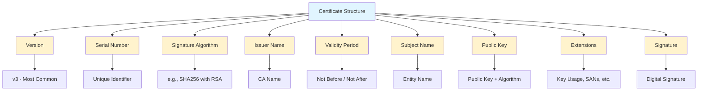

### Certificate Fields Explained

| Field | Description |
|-------|-------------|
| **Version** | Certificate format version (v1, v2, or v3) |
| **Serial Number** | Unique identifier assigned by the CA |
| **Signature Algorithm** | Algorithm used to sign the certificate |
| **Issuer** | The Certificate Authority that issued it |
| **Validity** | Period when certificate is valid (Not Before → Not After) |
| **Subject** | Entity the certificate belongs to |
| **Public Key** | Public key of the subject |
| **Extensions** | Additional properties (Key Usage, SANs, etc.) |

## Types of Certificates

### 1. By Validation Level

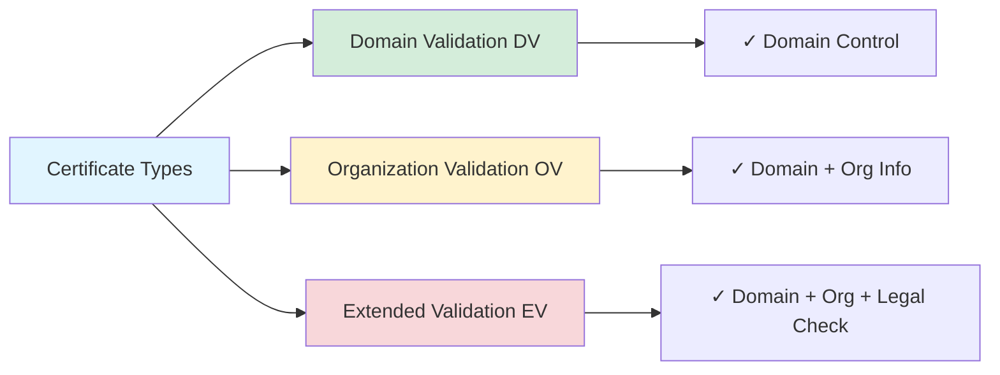

#### Domain Validation (DV)
- **Validation**: Confirms domain ownership
- **Time**: Minutes to hours
- **Use Cases**: Blogs, personal websites, internal systems
- **Example**: `*.example.com` for any subdomain

#### Organization Validation (OV)
- **Validation**: Confirms domain + organization legitimacy
- **Time**: 1-3 days
- **Use Cases**: Corporate websites, e-commerce
- **Information**: Shows organization name in certificate details

#### Extended Validation (EV)
- **Validation**: Most rigorous - legal, operational, and physical existence
- **Time**: 1-2 weeks
- **Use Cases**: Banks, financial institutions, payment gateways
- **Visual**: Green address bar (in older browsers)

### 2. By Scope/Usage

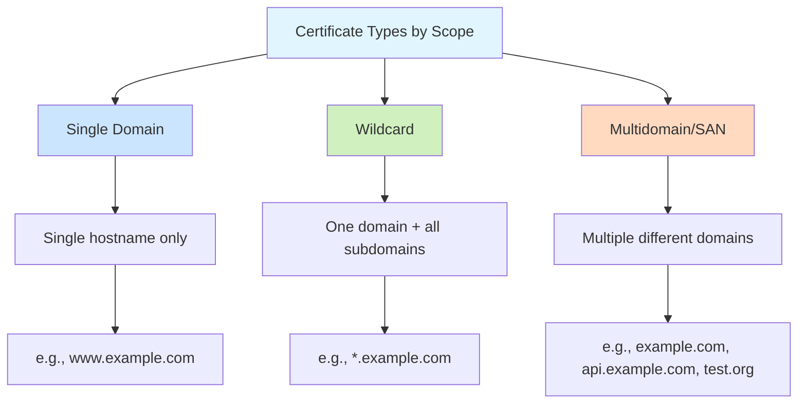

#### Single Domain Certificate
- Valid for one specific hostname only
- Example: `www.example.com`
- Cost-effective for single services

#### Wildcard Certificate
- Valid for one domain and all its subdomains
- Example: `*.example.com` covers:
  - `www.example.com` ✓
  - `api.example.com` ✓
  - `mail.example.com` ✓
  - `subdomain.example.com` ✓
- Cost-effective for multiple subdomains

#### Multi-Domain (SAN) Certificate
- Valid for multiple different domains
- Uses Subject Alternative Name (SAN) extension
- Example: covers `example.com`, `example.org`, `example.net`
- Ideal for organizations with multiple brands/domains

### 3. By Issuer Type

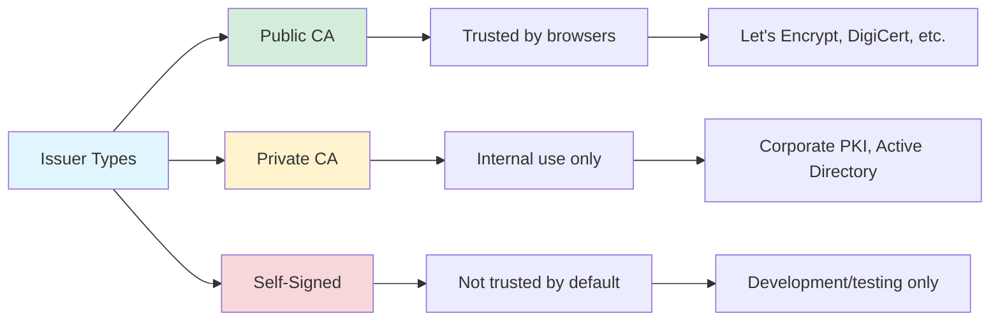

#### Public Certificate Authorities (CAs)
- Trusted by browsers and operating systems
- Examples: Let's Encrypt, DigiCert, Sectigo, GlobalSign
- Required for public-facing websites

#### Private Certificate Authorities
- Internal PKI infrastructure
- Used in corporate environments
- Certificates not trusted externally
- Common in enterprises with Active Directory

#### Self-Signed Certificates
- Created without a CA
- Not trusted by browsers (security warnings)
- Useful for development, testing, internal tools

## How Certificates Secure Communication

### The SSL/TLS Handshake Process

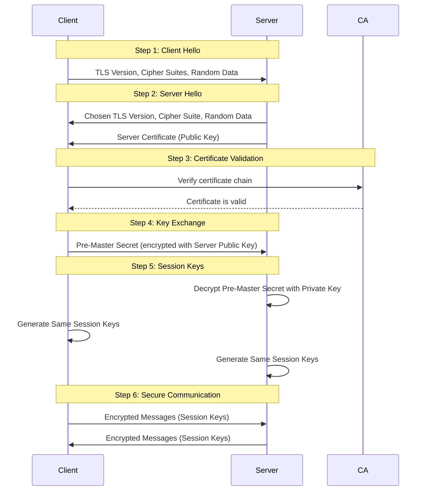

### Step-by-Step Breakdown

1. **Client Hello**: Client sends supported TLS versions and cipher suites
2. **Server Hello**: Server responds with chosen version and its certificate
3. **Certificate Validation**: Client verifies server certificate chain
4. **Key Exchange**: Client encrypts pre-master secret with server's public key
5. **Session Keys**: Both parties generate identical session keys
6. **Secure Communication**: All data encrypted with session keys

### Why This Matters

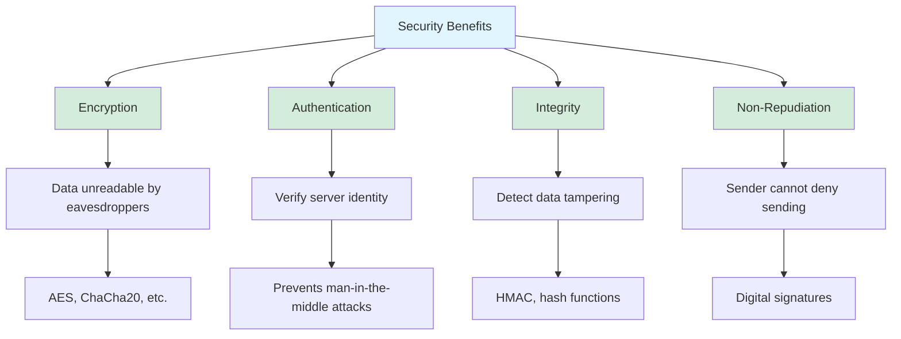

## Certificate Chain of Trust

### Understanding the Chain

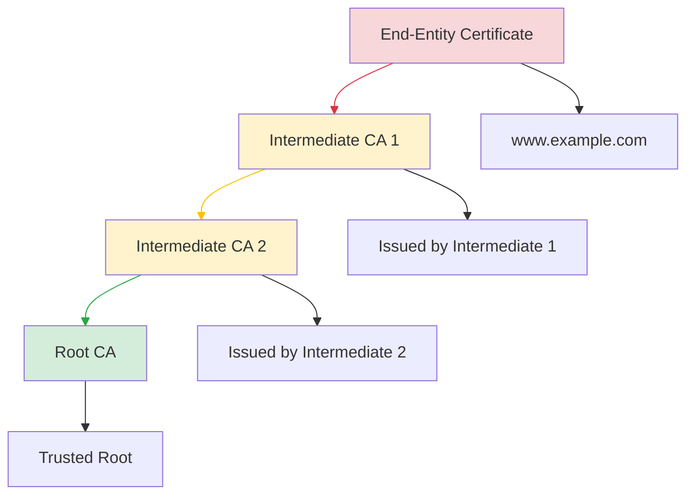

### Chain Components

| Level | Description |
|-------|-------------|
| **End-Entity** | Certificate for your domain/service |
| **Intermediate CA(s)** | Bridge between root and end-entity |
| **Root CA** | Self-signed, pre-trusted in browsers |

### Why Intermediate CAs?

1. **Security**: Root CA private keys can be offline/hardware-protected
2. **Flexibility**: Different intermediates for different validation levels
3. **Revocation**: Compromise affects only part of the chain
4. **Scalability**: Roots issue few intermediates; intermediates issue many end-entity certs

## Certificate Formats

### Common File Extensions

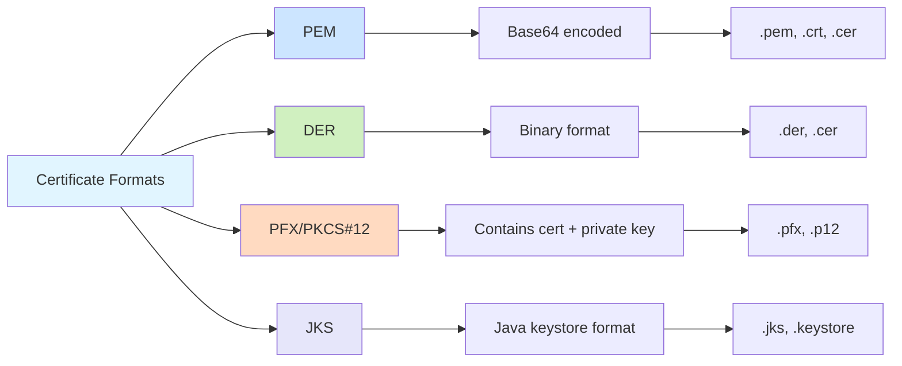

#### PEM (Privacy-Enhanced Mail)
- Base64-encoded text with headers
- Human-readable
- Common extensions: `.pem`, `.crt`, `.cer`
```text
-----BEGIN CERTIFICATE-----
MIIDXTCCAkWgAwIBAgIJAJC1HiIAZAiUMA0GCSqGSIb3DQEBCwUAMEUxCzAJBgNV
...
-----END CERTIFICATE-----
```

#### DER (Distinguished Encoding Rules)
- Binary format
- Not human-readable
- Common extensions: `.der`, `.cer`
- Smaller file size than PEM

#### PFX/PKCS#12
- Contains certificate + private key + chain
- Password-protected
- Used for importing/exporting certificates
- Common extensions: `.pfx`, `.p12`

#### JKS (Java KeyStore)
- Java-specific format
- Can contain multiple certificates/keys
- Extension: `.jks` or `.keystore`

## Certificate Expiration and Renewal

### The Problem of Expiration

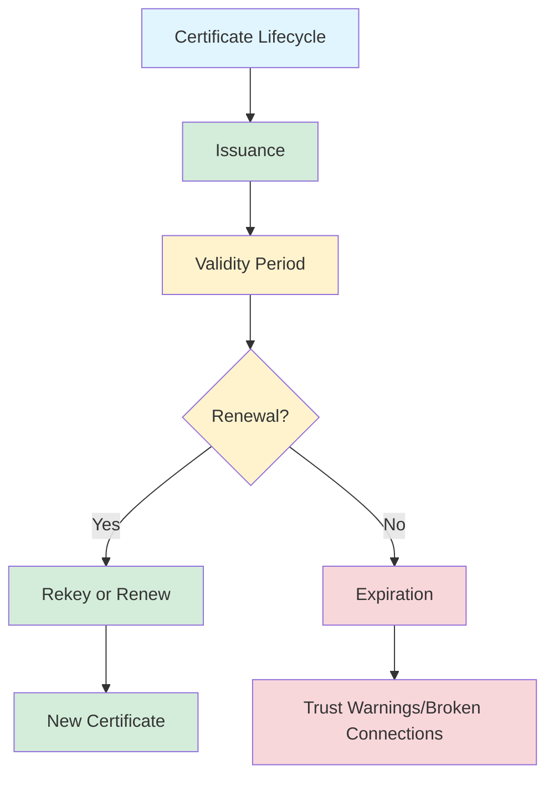

### Best Practices

1. **Monitor Expiration**: Set alerts 30-60 days before expiry
2. **Automate Renewal**: Use Let's Encrypt with auto-renewal scripts
3. **Plan for Rekeying**: Generate new keys during renewal (not reuse)
4. **Test in Staging**: Verify renewal process works before production

### Certificate Transparency (CT)

Certificate Transparency is a security standard that aims to prevent misissuance of SSL/TLS certificates. It works by:

1. **Public Logs**: All issued certificates are logged publicly
2. **Monitoring**: Domain owners can monitor for unauthorized certificates
3. **Auditing**: Anyone can audit CA behavior

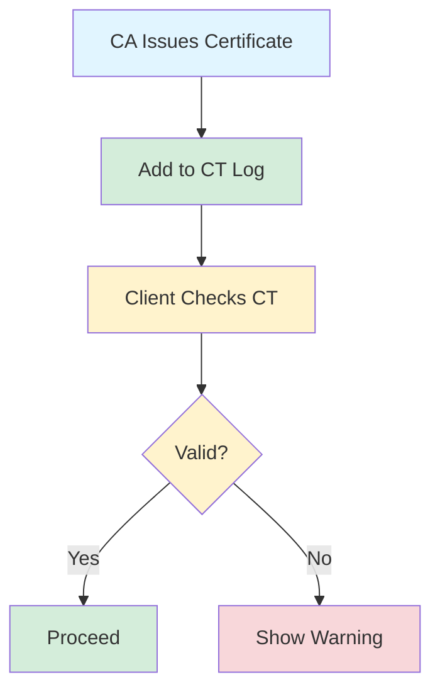

## Security Best Practices

### Certificate Management Checklist

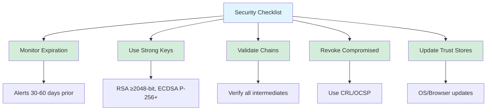

### Key Recommendations

1. **Key Strength**: Use RSA ≥2048-bit or ECDSA P-256+
2. **Signature Algorithm**: SHA-256 with RSA (RSA-SHA256)
3. **Certificate Chain**: Ensure complete chain is sent to clients
4. **OCSP Stapling**: Enable for faster revocation checks
5. **HSTS Header**: Implement HTTP Strict Transport Security

## Common Certificate Issues and Solutions

### Issue 1: Certificate Expired

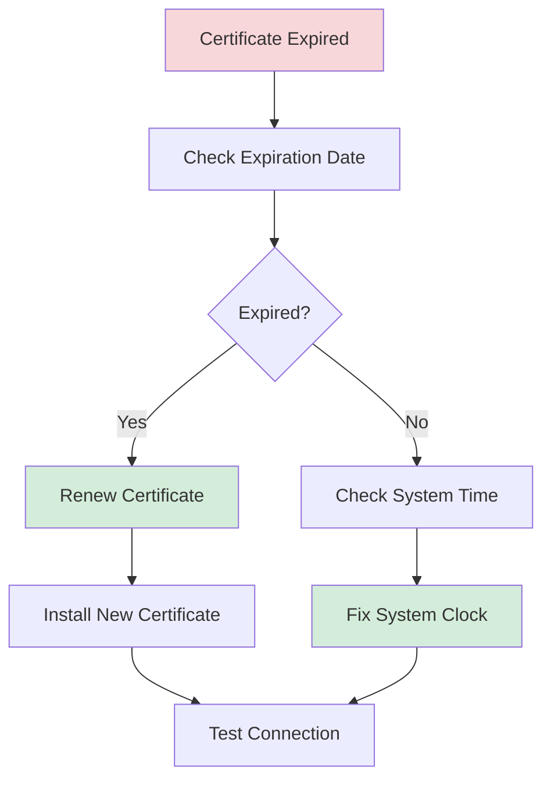

### Issue 2: Certificate Not Trusted

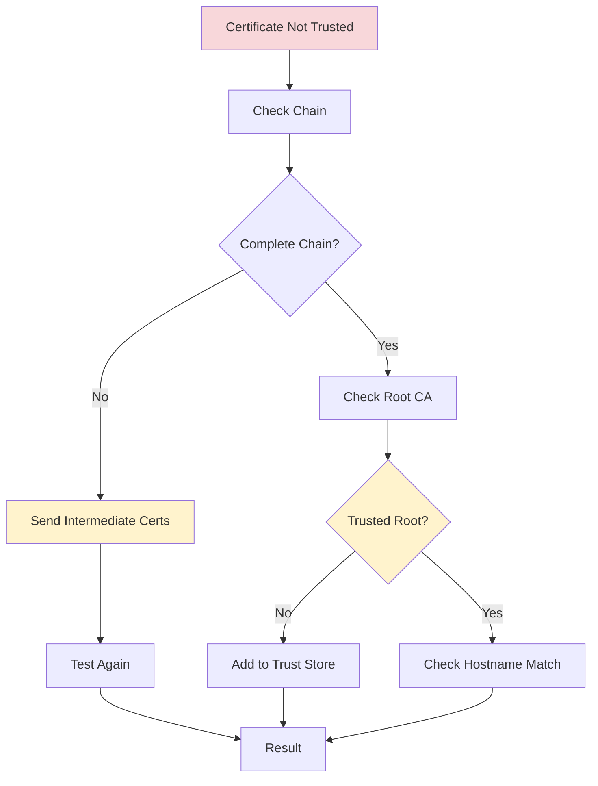

### Issue 3: Hostname Mismatch

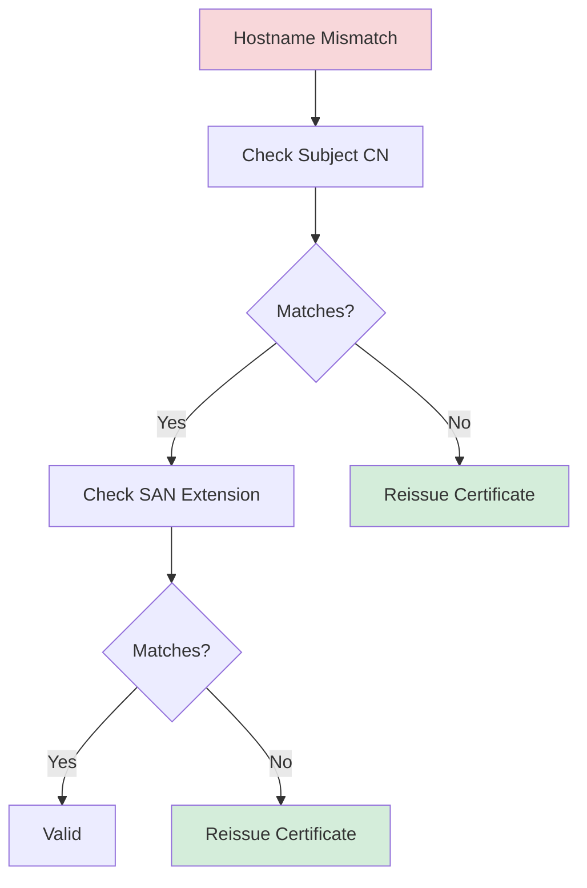

## Tools for Certificate Management

### Essential Commands

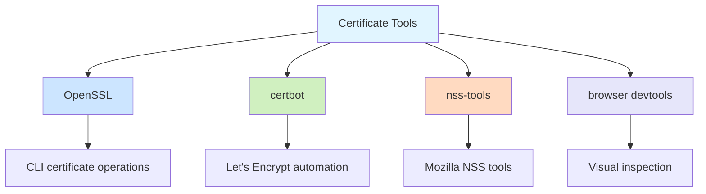

### OpenSSL Commands

```bash
# View certificate details
openssl x509 -in cert.pem -text -noout

# Check expiration date
openssl x509 -in cert.pem -noout -enddate

# Verify certificate chain
openssl verify -CAfile ca-bundle.crt cert.pem

# Extract public key
openssl x509 -in cert.pem -pubkey -noout

# Convert PEM to DER
openssl x509 -in cert.pem -outform DER -out cert.der
```

### Certbot (Let's Encrypt)

```bash
# Get certificate
certbot certonly --webroot -w /var/www/html -d example.com

# Renew all certificates
certbot renew

# Check expiration
certbot certificates
```

## Future of Certificates

### Emerging Trends

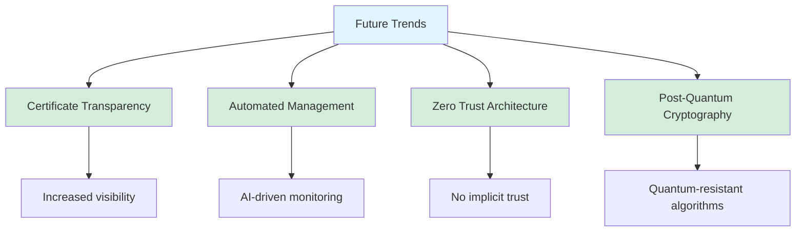

### Post-Quantum Cryptography

With quantum computers on the horizon, new cryptographic algorithms are being developed:

- **Lattice-based cryptography**: NTRU, CRYSTALS-Kyber
- **Hash-based signatures**: SPHINCS+
- **Code-based encryption**: Classic McEliece

## Conclusion

Certificates are fundamental to modern digital security. Understanding how they work, their types, and proper management practices is essential for developers, system administrators, and security professionals.

### Key Takeaways

1. Certificates bind public keys to identities
2. Different validation levels serve different needs
3. Certificate chains enable scalable trust
4. SSL/TLS handshakes establish secure connections
5. Proper management prevents security issues

## Further Reading

- [RFC 5280 - X.509 Certificate and CRL Profile](https://tools.ietf.org/html/rfc5280)
- [Mozilla's PKI Documentation](https://wiki.mozilla.org/CA)
- [Let's Encrypt Documentation](https://letsencrypt.org/docs/)
- [OWASP Certificate Validation Cheat Sheet](https://cheatsheetseries.owasp.org/cheatsheets/Certificate_Transparency_Cheat_Sheet.html)

---

**Related Posts**:
- [Certificates - Unable to get local issue certificate](/posts/basics/certificates/Unable-to-get-local-issuer-certificate-error)

