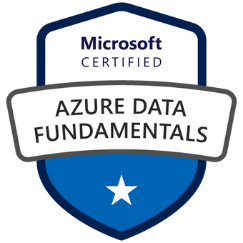
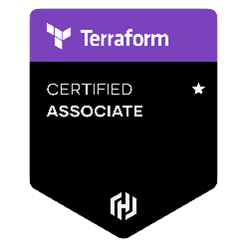
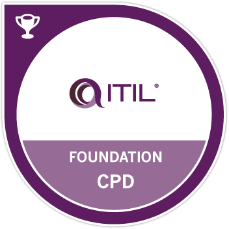

My name is Sakharam Shinde and I am a Cloud & DevOps Architect.

As a *Cloud & DevOps Architect* , I am a results-driven Cloud and DevOps Architect with a passion for designing and implementing cutting-edge solutions to drive business success. With 12 years of hands-on experience in the field, I have honed my expertise in crafting scalable, secure, and high-performance cloud-based infrastructures that empower organizations to thrive in the digital age. I am an Azure Administrator and a Terraform Associate certified. 

You can reach out to me on [LinkedIn](https://www.linkedin.com/in/sakharamshinde/) or checkout my blog where I share my learnings and experiences.

As an open-source enthusiast , I am active on GitHub/GitLab and have hosted few of my projects providing step-by-step instructions to setup and deploy them to understand different tools used in Cloud and DevOps.

\
\
<!-- Certifications Start -->

    

    

        
        
        
        
        
    

    

<!-- Certifications End -->

\
\
I started my career started with Office365 and Microsoft Exchange providing expert guidance to Microsoft customers by understanding their queries. Later, I got a change to work on the database technologies like MS SQL, Postgres, etc. and automating all the daily operations for a database engineer. For the past 8 years, I have been continously learning multiple cloud and devops technologies (listed below) with hand-on experience on multiple projects.

In my spare time I like to go on short day cycle trips to enjoy the weather and stay fit. The maximum distance that I have been able to acheive in a trip was 80 kms.
 
 

| Category | Tools & Technlogies | 
| -------- | ------------------- |
| Cloud | AWS, Azure, GCP |
| Configuration Management | Ansible, Puppet |
| Security | SonarQube, Qualys, Tfsec, Microsoft Defender | 
| Orchestration Tools | Docker, Kubernetes, AKS, EKS, GKE, Git | 
| CI/CD | Azure DevOps, Jenkins, GitLab CI/CD | 
| Automation/Scripting | PowerShell, Shell Scripting, TSQL | 
| Infrastructure as Code | 	Terraform, ARM, AWS CloudFormation | 
| Database | Microsoft SQL Server, PostgreSQL | 
| Virtualization | Hyper-V, VMWare, Docker | 
| Operating Systems | Windows Server, Linux (Ubuntu, CentOS) | 
| ITSM Tools | ServiceNow, JIRA | 
| Monitoring Tools | Prometheus, Grafana, Datadog, Loki, Splunk, PRTG, Spotlight | 
| IAM | Active Directory Services, ADFS, DirSync, DNS, DHCP, SSO | 
| Mail & Calendar Services | Exchange Server, Office 365, EAS | 

